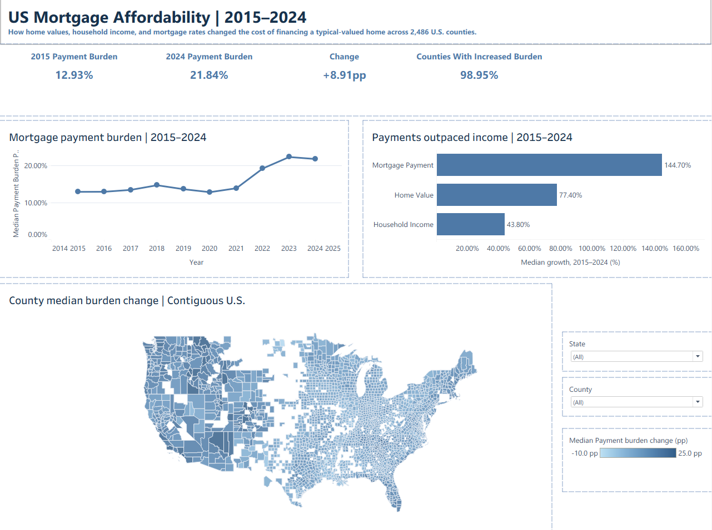

# U.S. Mortgage Affordability Analysis

## County-Level Housing Affordability Trends, 2015–2024

### Project Overview

How has the affordability of financing a typical-valued home changed across the United States?

This project analyzes county-level changes in mortgage affordability from **2015 through 2024** by combining housing values, household income, and mortgage-rate data from three sources:

- **Zillow Home Value Index (ZHVI)** — county-level typical home values
- **U.S. Census Bureau SAIPE** — county-level median household income estimates
- **Freddie Mac / FRED** — U.S. 30-year fixed mortgage rates

Using these datasets, I built a standardized mortgage-payment model that estimates the monthly principal-and-interest payment for a buyer purchasing a typical-valued home with a **20% down payment and a 30-year fixed-rate mortgage**.

I then measure affordability using:

**Payment Burden = Annual Modeled Mortgage Payment / Median Household Income**

The final analysis uses a **balanced panel of 2,486 U.S. counties** with complete observations across all 10 years from 2015–2024.

---

## Dashboard



**Interactive Tableau Dashboard:** [Mortgage Affordability Dashboard](https://public.tableau.com/views/MortgageAffordabilityFinal/MortgageAffordability?:language=en-US&publish=yes&:sid=&:redirect=auth&:display_count=n&:origin=viz_share_link)

The dashboard summarizes:

- Changes in median county mortgage-payment burden from 2015–2024
- Growth in home values, household income, and modeled mortgage payments
- Geographic variation in affordability changes across U.S. counties
- Headline affordability indicators from the balanced county panel

---

## Key Findings

### 1. Modeled mortgage affordability deteriorated substantially

Across the balanced panel of 2,486 counties, median modeled principal-and-interest payment burden increased from:

**12.93% of median household income in 2015**

to

**21.84% in 2024**

This represents an increase of approximately **8.91 percentage points**.

Approximately **98.95% of counties** in the balanced panel experienced an increase in modeled payment burden between 2015 and 2024.

---

### 2. Home values grew considerably faster than household income

Between 2015 and 2024, the median county experienced approximately:

| Metric | Median Growth |
|---|---:|
| Household Income | 43.8% |
| Home Value | 77.4% |
| Modeled Mortgage Payment | 144.7% |

While median county home values increased substantially faster than household income, modeled mortgage payments grew even faster because financing costs also increased.

---

### 3. Low mortgage rates temporarily offset rising home values

The affordability trend was not a steady deterioration throughout the entire period.

Median modeled payment burden remained relatively stable through 2021 and reached approximately **12.84% in 2020**, even though home values had already increased considerably from their 2015 levels.

The annual average 30-year fixed mortgage rate declined from approximately **3.85% in 2015** to **3.11% in 2020** and **2.96% in 2021**.

Lower financing costs therefore helped offset rising home values during this period.

---

### 4. Affordability deteriorated sharply after 2021

The annual average 30-year mortgage rate increased from approximately:

- **2.96% in 2021**
- **5.34% in 2022**
- **6.81% in 2023**
- **6.72% in 2024**

Over the same period, median modeled payment burden across counties increased from approximately:

- **13.91% in 2021**
- **19.28% in 2022**
- **22.39% in 2023**
- **21.84% in 2024**

This demonstrates why evaluating housing affordability using home prices alone can miss an important component of the buyer's financing cost.

---

## Analytical Question

The primary question investigated in this project is:

> **How did the cost of financing a typical-valued home relative to household income change across U.S. counties between 2015 and 2024?**

Supporting questions include:

- How quickly did home values grow relative to household income?
- How did changes in mortgage rates affect modeled monthly payments?
- How widespread was the deterioration in modeled affordability?
- How did affordability changes vary geographically across counties?

---

## Data Sources

### Zillow Home Value Index

County-level monthly Zillow Home Value Index data were used as the housing-value measure.

ZHVI represents Zillow's estimate of the **typical home value** within a geography and should not be interpreted as a median home sale price.

Monthly observations were converted into annual values by calculating the arithmetic mean for county-years containing all 12 monthly observations.

County-years with incomplete monthly coverage were excluded from the primary annual housing dataset.

---

### U.S. Census Bureau — Small Area Income and Poverty Estimates (SAIPE)

Annual county-level **median household income** estimates from the Census Bureau's SAIPE program were used as the income measure for 2015–2024.

The dataset also contains 90% confidence limits for median household income.

SAIPE was selected because it provides annual county-level income estimates, including estimates for relatively small counties.

---

### Freddie Mac / FRED — 30-Year Fixed Mortgage Rate

Weekly observations from the Freddie Mac **30-Year Fixed Rate Mortgage Average in the United States (MORTGAGE30US)** were used as the mortgage-rate benchmark.

Weekly observations were converted into annual mortgage rates using the arithmetic mean for each year.

The rate is a national benchmark and does not represent county-specific borrower mortgage rates.

---

## Data Preparation

### 1. Zillow Reshaping and Annualization

The original Zillow dataset was stored in wide format, with individual monthly dates represented as columns.

The dataset was transformed from:

**One row per county with many monthly columns**

into:

**One row per county-month**

using Pandas.

A five-digit county FIPS identifier was constructed from the state and county FIPS components.

Monthly observations were then aggregated to the county-year level.

To maintain consistent annual measurements, a county-year was retained only when all **12 monthly ZHVI observations** were available.

For the 2015–2024 analysis period:

- Potential county-year observations: **30,710**
- Complete 12-month housing observations: **29,146**
- Incomplete county-year observations excluded: **1,564**

---

### 2. Census SAIPE Parsing

The annual SAIPE datasets were distributed as fixed-width text files.

An initial parsing approach that relied on automatically inferred column widths produced invalid income confidence bounds for a subset of high-income counties. Inspection showed that some six-digit income values were being incorrectly split across fields.

To correct the issue, I replaced inferred widths with the **explicit field positions from the Census SAIPE file layout**.

The corrected parsing process successfully validated the expected relationship:

**Income Lower Bound ≤ Median Household Income ≤ Income Upper Bound**

with zero invalid bounds after parsing.

This provided an important data-quality check before the income data were incorporated into the affordability model.

---

### 3. Geographic Matching

Housing and income datasets were joined using:

**5-digit County FIPS + Year**

rather than county names.

Using geographic identifiers reduces errors caused by differences in spelling, punctuation, naming conventions, and duplicate county names across states.

The Zillow–SAIPE merge produced:

- **29,122 matched county-year observations**
- **24 unmatched housing observations**

The 24 unmatched records were associated with Connecticut geography changes during 2022–2024, where legacy county identifiers in the housing data did not align with Census planning-region geography.

Rather than forcing a potentially incorrect geographic match, these observations were retained in an audit step and excluded from the affordability analysis.

---

### 4. Mortgage Rate Processing

Weekly Freddie Mac mortgage-rate observations were converted into annual averages.

The annual mortgage-rate dataset was then joined to the county-level housing and income dataset by year.

Because the mortgage rate is national, every county within a given year receives the same annual benchmark rate.

---

## Mortgage Payment Model

The analysis models a standardized home purchase using the following assumptions:

- **Home value:** Annual county ZHVI
- **Down payment:** 20%
- **Loan-to-value:** 80%
- **Mortgage term:** 30 years
- **Number of monthly payments:** 360
- **Interest rate:** Annual average Freddie Mac 30-year fixed mortgage rate
- **Payment modeled:** Principal and interest only

Loan principal is calculated as:

**Loan Amount = Home Value × 0.80**

The standard fixed-rate mortgage payment formula is then applied:

**Monthly Payment = P × [r / (1 − (1 + r)^−360)]**

where:

- **P** = loan principal
- **r** = monthly mortgage interest rate
- **360** = number of monthly payments

The annual payment burden is:

**Payment Burden = (Monthly Payment × 12) / Median Household Income**

I also calculate:

**Price-to-Income Ratio = Annual ZHVI / Median Household Income**

This allows the analysis to distinguish between a home-price affordability measure and a financing-based affordability measure that incorporates mortgage rates.

---

## Validation and Quality Assurance

Several validation checks were performed throughout the workflow.

### Geographic and Dataset Validation

- Verified uniqueness of county FIPS-year keys
- Checked for duplicate observations before and after joins
- Verified annual Zillow observations contained 12 months
- Audited unmatched Zillow–SAIPE county-year observations
- Confirmed mortgage-rate coverage across the analysis period

### Income Validation

SAIPE confidence limits were checked to verify:

**Lower Bound ≤ Income Estimate ≤ Upper Bound**

The validation initially exposed a fixed-width parsing problem, which was corrected using explicit Census field positions.

### Mortgage Model Validation

The mortgage-payment formula was independently tested using a controlled mortgage scenario with known inputs.

A separate row-level reconstruction was also used to verify that the DataFrame implementation matched the standalone mortgage calculation.

### Economic Sanity Checks

Core variables were checked for economically invalid values, including:

- Nonpositive home values
- Nonpositive household income
- Nonpositive modeled mortgage payments
- Negative payment burden

---

## Balanced Panel Construction

For the primary 2015–2024 comparison, I constructed a balanced panel containing counties with analytically complete observations in **every year of the study period**.

The final main panel contains:

**2,486 counties × 10 years = 24,860 county-year observations**

Using a balanced panel ensures that changes in annual statistics are not driven simply by counties entering or leaving the sample over time.

Each county receives equal weight in the county-level summary statistics.

Therefore, results such as the median payment burden describe the **median county in the balanced panel**, not the affordability experience of the median U.S. household.

---

## Income Estimate Uncertainty

SAIPE provides 90% confidence limits around its median household-income estimates.

Because household income appears in the denominator of the payment-burden calculation:

- The **upper income estimate** produces a lower payment-burden estimate.
- The **lower income estimate** produces a higher payment-burden estimate.

Corresponding burden bounds were calculated as a sensitivity measure for uncertainty in the SAIPE income estimate.

These bounds should **not** be interpreted as comprehensive confidence intervals for the affordability model because uncertainty in Zillow home values, mortgage rates, and model assumptions is not incorporated.

---

## Limitations

This analysis is intended as a standardized affordability scenario rather than a measure of actual household housing expenditures.

Important limitations include:

### Principal and Interest Only

The mortgage model excludes:

- Property taxes
- Homeowners insurance
- Flood insurance
- HOA fees
- Maintenance
- Closing costs
- Mortgage insurance where applicable

Actual homeownership costs would therefore generally be higher than the modeled principal-and-interest payment.

### Standardized 20% Down Payment

The model assumes every hypothetical buyer makes a 20% down payment.

Actual down payments vary substantially across borrowers, and the ability to accumulate a down payment is itself an important affordability constraint.

### Median Household Income Is Not Buyer Income

County median household income is used as a standardized denominator and does not necessarily represent the income of prospective homebuyers.

### National Mortgage Rate

The Freddie Mac mortgage rate is a national benchmark.

Actual borrower rates vary according to credit characteristics, loan structure, lender, geography, and market conditions.

### ZHVI Is Not a Sale Price

Zillow ZHVI measures the estimated value of a typical home and should not be interpreted as the median transaction price paid by buyers in a particular year.

### Equal County Weighting

Each county contributes equally to the national county-level statistics regardless of population.

As a result, the findings describe geographic patterns across counties rather than population-weighted affordability for U.S. households.

### Geographic Changes

Connecticut geography changes created 24 unmatched county-year observations during the Zillow–SAIPE merge. These records were excluded rather than forcing a geographic crosswalk.

---

## Tools & Technologies

**Python**
- Pandas
- NumPy
- Matplotlib
- Jupyter Notebook

**Data Analysis**
- Data cleaning
- Fixed-width file parsing
- Missing-data analysis
- Data reshaping
- Dataset joins
- Panel-data construction
- Mortgage modeling
- Validation and QA
- Exploratory data analysis

**Visualization**
- Tableau

**Data Sources**
- Zillow
- U.S. Census Bureau SAIPE
- Freddie Mac / FRED

---

## Repository Structure

```text
README.md
Mortgage-Affordability-Analysis/
├── REPORT.md
├── .gitignore
├── requirements.txt
├── data/
│   ├── README.md
│   ├── raw/
│   │   ├── County_zhvi.csv
│   │   ├── zhvi.csv
│   │   ├── MORTGAGE30US.xlsx
│   │   ├── mortgage30us.csv
│   │   └── saipe_2015.txt … saipe_2024.txt
│   └── processed/
│       ├── affordability_trends.csv
│       ├── county_affordability_changes.csv
│       ├── growth_comparison.csv
│       └── top_10_deterioration.csv
├── notebooks/
│   └── housing_analytics_final.ipynb
├── tableau/
│   └── Mortgage Affordability Final.twb
└── images/
    └── dashboard.png
```

- **[data/](data/README.md):** source datasets in `raw/` and exported dashboard tables in `processed/`.
- **[notebooks/](notebooks/housing_analytics_final.ipynb):** the analysis, validation checks, charts, and CSV exports.
- **[tableau/](tableau/):** the Tableau workbook used to build the dashboard.
- **[images/](images/):** dashboard screenshot used in this README.

## Running the Analysis

1. Clone this repository and open a terminal in its root folder.
2. Install the Python dependencies with `python -m pip install -r requirements.txt`.
3. Start Jupyter with `jupyter notebook` and open `notebooks/housing_analytics_final.ipynb`.
4. Run the notebook cells in order. It locates `data/raw/` from the repository root or the `notebooks/` folder and writes exports to `data/processed/`, replacing matching CSVs.

To view the dashboard locally, open `tableau/Mortgage Affordability Final.twb` in Tableau and reconnect its CSV data sources to this clone's `data/processed/` folder if prompted. The workbook is a `.twb` file; its data is supplied separately in this repository.

---

## Skills Demonstrated

This project demonstrates an end-to-end analytics workflow including:

- Combining multiple public datasets with different frequencies and structures
- Reshaping monthly wide-format housing data into an analytical panel
- Parsing fixed-width government datasets
- Constructing and validating geographic identifiers
- Diagnosing data-quality and parsing issues
- Joining datasets at different grains
- Building and validating a financial model
- Creating a balanced longitudinal county panel
- Translating analytical results into an interactive Tableau dashboard
- Communicating assumptions and limitations alongside findings

---

## Future Enhancements

The current version focuses on producing a clear and reproducible county-level affordability analysis.

Potential extensions include:

- Decomposing the affordability change into separate home-value, mortgage-rate, and income contributions
- Performing sensitivity analysis under alternative housing-data completeness thresholds
- Replicating key analytical outputs in SQL
- Adding 2025 housing and mortgage-rate context as new data become available
- Exploring population-weighted affordability measures
- Adding state- and regional-level comparisons
- Expanding the model to incorporate estimated property taxes and homeowners insurance

---

## Conclusion

Mortgage affordability is influenced by more than home prices alone.

Across the balanced panel of 2,486 U.S. counties analyzed in this project, median modeled principal-and-interest burden increased from **12.93% of median household income in 2015 to 21.84% in 2024**.

Over the same period, the median county experienced approximately **77.4% growth in home values compared with 43.8% growth in household income**, while modeled mortgage payments increased approximately **144.7%**.

The time series also shows the importance of financing conditions. Low mortgage rates helped offset rising home values through 2020–2021, while the subsequent increase in rates coincided with a sharp rise in modeled payment burden.

Overall, the project demonstrates how integrating **housing values, household income, and financing costs** provides a more complete view of mortgage affordability than analyzing home-price growth alone.
